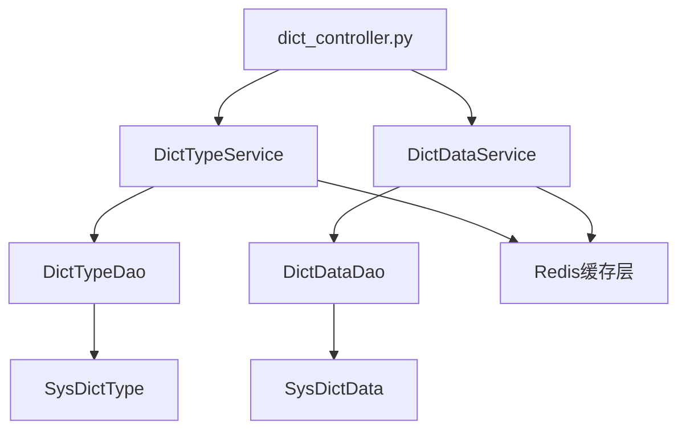

## 概要总结

字典模块是 RuoYi-Vue3-FastAPI 系统中的核心基础功能模块，实现了数据字典的统一管理和缓存机制。该模块采用两层架构设计：字典类型管理（sys_dict_type）和字典数据管理（sys_dict_data），为系统提供标准化的枚举值管理功能，支持动态配置和 Redis 缓存优化。

## 模块架构

### 目录结构
```
ruoyi-fastapi-backend/module_admin/
├── controller/
│   └── dict_controller.py           # API 控制层，提供字典类型和数据的 RESTful 接口
├── dao/
│   └── dict_dao.py                  # 数据访问层，包含 DictTypeDao 和 DictDataDao
├── service/
│   └── dict_service.py              # 业务逻辑层，包含 DictTypeService 和 DictDataService
├── entity/
│   ├── do/
│   │   └── dict_do.py              # 数据库实体类，定义 SysDictType 和 SysDictData
│   └── vo/
│       └── dict_vo.py              # 视图对象类，定义各种请求响应模型
```

### 组件层次结构


### 依赖关系和导入
- **数据库依赖**: SQLAlchemy ORM, AsyncSession
- **缓存依赖**: Redis (通过 request.app.state.redis)
- **配置依赖**: RedisInitKeyConfig.SYS_DICT
- **工具依赖**: CamelCaseUtil, PageUtil, ExcelUtil
- **验证依赖**: pydantic, pydantic_validation_decorator

## 核心功能分析

### 主要功能

#### 1. 字典类型管理 (DictTypeService)
- **文件位置**: `module_admin/service/dict_service.py:L21-L201`
- **实现方式**: 
  ```python
  class DictTypeService:
      # 获取字典类型列表，支持分页和条件查询
      async def get_dict_type_list_services(cls, query_db, query_object, is_page=False)
      
      # 校验字典类型唯一性
      async def check_dict_type_unique_services(cls, query_db, page_object)
      
      # 新增字典类型并同步缓存
      async def add_dict_type_services(cls, request, query_db, page_object)
      
      # 编辑字典类型并更新关联的字典数据
      async def edit_dict_type_services(cls, request, query_db, page_object)
      
      # 删除字典类型并清理缓存
      async def delete_dict_type_services(cls, request, query_db, page_object)
  ```
- **功能目的**: 管理系统中的数据字典类别，如"用户性别"、"系统开关"等基础分类
- **关键依赖**: DictTypeDao, Redis缓存, 数据唯一性验证

#### 2. 字典数据管理 (DictDataService)
- **文件位置**: `module_admin/service/dict_service.py:L208-L460`
- **实现方式**:
  ```python
  class DictDataService:
      # 获取字典数据列表
      async def get_dict_data_list_services(cls, query_db, query_object, is_page=False)
      
      # 从缓存获取字典数据
      async def query_dict_data_list_from_cache_services(cls, redis, dict_type)
      
      # 初始化系统字典缓存
      async def init_cache_sys_dict_services(cls, query_db, redis)
      
      # CRUD 操作：新增、编辑、删除字典数据
      async def add_dict_data_services(cls, request, query_db, page_object)
      async def edit_dict_data_services(cls, request, query_db, page_object)
      async def delete_dict_data_services(cls, request, query_db, page_object)
  ```
- **功能目的**: 管理具体的字典数据项，如性别字典下的"男"、"女"选项
- **关键依赖**: DictDataDao, Redis缓存, 自动缓存更新机制

#### 3. Redis 缓存机制
- **文件位置**: `module_admin/service/dict_service.py:L250-L295`
- **实现方式**:
  ```python
  # 缓存键格式: sys_dict:{dict_type}
  cache_key = f'{RedisInitKeyConfig.SYS_DICT.key}:{dict_type}'
  
  # 初始化缓存：将所有正常状态的字典类型及其数据缓存到 Redis
  async def init_cache_sys_dict_services(cls, query_db, redis):
      keys = await redis.keys(f'{RedisInitKeyConfig.SYS_DICT.key}:*')
      if keys:
          await redis.delete(*keys)  # 清理旧缓存
      
      # 重新加载所有字典数据到缓存
      for dict_type_obj in [item for item in dict_type_all if item.status == '0']:
          dict_data = await DictDataDao.query_dict_data_list(query_db, dict_type)
          await redis.set(cache_key, json.dumps(dict_data, ensure_ascii=False, default=str))
  ```
- **功能目的**: 提供高性能的字典数据查询，减少数据库访问
- **关键依赖**: Redis, JSON序列化, 自动缓存同步

### 次要功能

#### 1. 数据导出功能
- **文件位置**: 
  - 字典类型导出: `dict_service.py:L170-L196`
  - 字典数据导出: `dict_service.py:L436-L458`
- **实现方式**: 使用 ExcelUtil 将字典数据转换为 Excel 格式
- **功能目的**: 支持字典数据的批量导出和备份

#### 2. 数据验证机制
- **文件位置**: `dict_vo.py:L24-L40, L59-L84`
- **实现方式**: 
  ```python
  # 字典类型验证
  @NotBlank(field_name='dict_name', message='字典名称不能为空')
  @Size(field_name='dict_name', min_length=0, max_length=100)
  @Pattern(field_name='dict_type', regexp='^[a-z][a-z0-9_]*$')
  
  # 字典数据验证
  @NotBlank(field_name='dict_label', message='字典标签不能为空')
  @NotBlank(field_name='dict_value', message='字典键值不能为空')
  ```
- **功能目的**: 确保数据完整性和格式规范

## 关键实现细节

### 状态管理
字典系统使用状态码进行生命周期管理：
- **状态字段**: `status` ('0': 正常, '1': 停用)
- **应用场景**: 只有正常状态的字典才会被缓存和对外提供服务
- **实现位置**: `dict_do.py:L15, L35`

### 类型系统
采用 Pydantic 模型进行类型定义和验证：

#### 核心数据模型
```python
# 字典类型模型
class DictTypeModel(BaseModel):
    dict_id: Optional[int] = Field(description='字典主键')
    dict_name: Optional[str] = Field(description='字典名称') 
    dict_type: Optional[str] = Field(description='字典类型')
    # ... 其他字段

# 字典数据模型  
class DictDataModel(BaseModel):
    dict_code: Optional[int] = Field(description='字典编码')
    dict_label: Optional[str] = Field(description='字典标签')
    dict_value: Optional[str] = Field(description='字典键值')
    dict_type: Optional[str] = Field(description='字典类型')
    # ... 其他字段
```

### 性能考虑
1. **分页查询**: 所有列表查询均支持分页，通过 `PageUtil.paginate()` 实现
2. **Redis 缓存**: 字典数据全部缓存到 Redis，查询时直接从缓存获取
3. **异步操作**: 全部使用 async/await 模式，提高并发性能
4. **索引优化**: 数据库表使用唯一约束和适当的索引

### 错误处理
- **业务异常**: 使用 `ServiceException` 处理业务逻辑错误
- **数据库异常**: 事务回滚机制，确保数据一致性
- **缓存异常**: 缓存操作失败时不影响业务流程，但会记录日志

## 集成点

### 数据库集成
- **表结构**: `sys_dict_type` 和 `sys_dict_data` 两张表
- **关系**: 一对多关系 (一个字典类型对应多个字典数据)
- **约束**: 字典类型具有唯一性约束

### Redis 缓存集成
- **缓存键**: `sys_dict:{dict_type}` 格式
- **数据格式**: JSON 字符串存储
- **更新策略**: 写入数据库后立即更新缓存

### API 接口集成
- **路由前缀**: `/system/dict`
- **权限控制**: 通过 `CheckUserInterfaceAuth` 进行接口权限验证
- **日志记录**: 使用 `@Log` 装饰器记录操作日志

## 代码示例

### 字典数据查询示例
```python
# 从缓存获取字典数据
@dictController.get('/data/type/{dict_type}')
async def query_system_dict_type_data(request: Request, dict_type: str):
    dict_data_result = await DictDataService.query_dict_data_list_from_cache_services(
        request.app.state.redis, dict_type
    )
    return ResponseUtil.success(data=dict_data_result)
```

### 缓存更新示例
```python
# 新增字典数据时自动更新缓存
async def add_dict_data_services(cls, request, query_db, page_object):
    # 1. 数据库操作
    await DictDataDao.add_dict_data_dao(query_db, page_object)
    await query_db.commit()
    
    # 2. 更新缓存
    dict_data_list = await cls.query_dict_data_list_services(query_db, page_object.dict_type)
    await request.app.state.redis.set(
        f'{RedisInitKeyConfig.SYS_DICT.key}:{page_object.dict_type}',
        json.dumps(CamelCaseUtil.transform_result(dict_data_list), ensure_ascii=False, default=str)
    )
```

## 架构决策

### 1. 两层表设计
**决策**: 采用 `sys_dict_type` (字典类型) + `sys_dict_data` (字典数据) 的双表结构
**原因**: 
- 便于分类管理不同类型的字典
- 支持字典类型的统一配置和管理
- 提供更好的数据组织和查询性能

### 2. Redis 全量缓存策略
**决策**: 将所有正常状态的字典数据全量缓存到 Redis
**原因**:
- 字典数据访问频率极高，缓存可显著提升性能
- 字典数据相对稳定，变更频率低
- 全量缓存可避免缓存击穿问题

### 3. 异步编程模式
**决策**: 全面采用 async/await 异步编程
**原因**:
- 配合 FastAPI 框架的异步特性
- 提高系统并发处理能力
- 更好地处理数据库和 Redis 的 I/O 操作

### 4. 严格的数据验证
**决策**: 使用 Pydantic 进行严格的输入验证
**原因**:
- 字典数据作为基础数据，必须保证准确性
- 防止无效数据影响系统稳定性
- 提供清晰的错误信息给前端用户

## 潜在改进点

### 1. 缓存策略优化
- **当前问题**: 字典数据更新时需要重新查询数据库并更新整个缓存
- **改进建议**: 考虑增量更新策略，只更新变更的部分

### 2. 批量操作支持
- **当前问题**: 缺少批量导入字典数据的功能
- **改进建议**: 增加 Excel 批量导入功能，支持大量字典数据的快速录入

### 3. 版本控制
- **当前问题**: 缺少字典数据的变更历史记录
- **改进建议**: 增加字典数据变更日志，便于审计和回滚

### 4. 分布式缓存一致性
- **当前问题**: 多实例部署时缓存更新可能存在延迟
- **改进建议**: 使用 Redis 发布订阅机制实现分布式缓存同步

## 总结

RuoYi-Vue3-FastAPI 的字典模块设计合理，实现完整，具备以下关键优势：

1. **架构清晰**: 采用经典的三层架构，职责分离明确
2. **性能优化**: Redis 缓存机制显著提升查询性能
3. **数据安全**: 严格的输入验证和事务管理确保数据完整性
4. **扩展性好**: 模块化设计便于功能扩展和维护
5. **标准化**: 为系统其他模块提供统一的枚举值管理服务

该模块是系统基础设施的重要组成部分，为用户管理、权限控制、系统配置等上层业务模块提供了可靠的数据字典支撑。通过合理的缓存策略和异步操作，在保证数据一致性的同时实现了良好的性能表现。